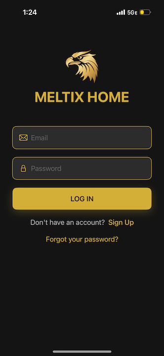
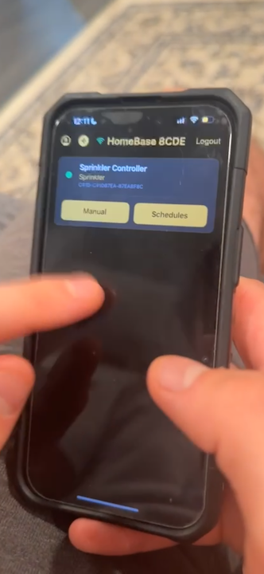
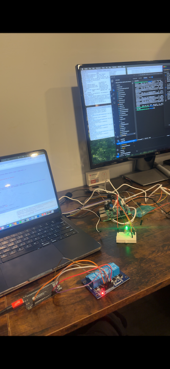
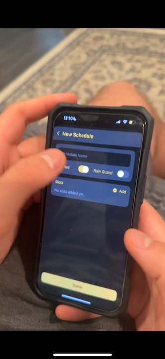
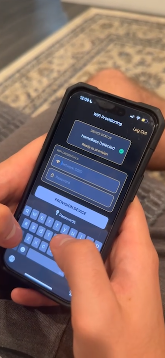
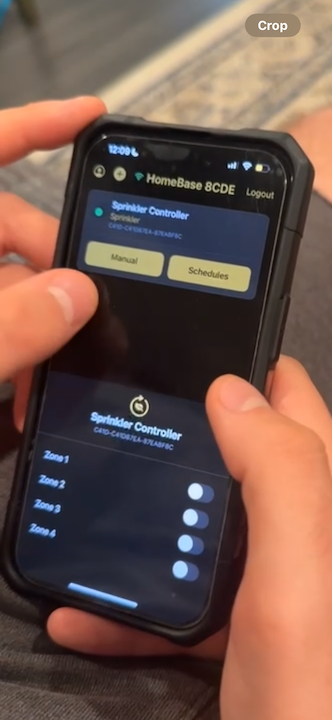

# Meltix Home Automation — iOS Frontend

This is the **public repository version** of the Meltix iOS app.  
The private version contains full Xcode project configuration files, signing data, and environment-specific settings that are excluded here for security reasons.

The **Meltix App** provides an intuitive mobile interface for managing and monitoring all smart home devices connected through the Meltix ecosystem.

---

#### Backend Repository: https://github.com/tomSadowy7/MeltixOfficialBackend

## Overview

The app communicates with the **Meltix Backend** and **Raspberry Pi HomeBase** to provide seamless device control and status updates across your home.

Users can:
- **Sign Up / Log In** — create and authenticate accounts securely.  
- **Reset Password** — request password recovery and manage credentials.  
- **Bluetooth Provisioning** — pair with the Raspberry Pi to transfer Wi-Fi credentials and establish a secure connection.  
- **Sprinkler Zone Control** — turn on or off specific sprinkler zones directly from the app.  
- **Schedule Automation** — create and manage watering schedules for each sprinkler zone.  
- **Edit Profile** — update personal information and account settings.  
- **Report Bugs / Feedback** — submit in-app reports for maintenance or usability issues.

### Some Screenshots from a video I recorded about Meltix Home Automation:

